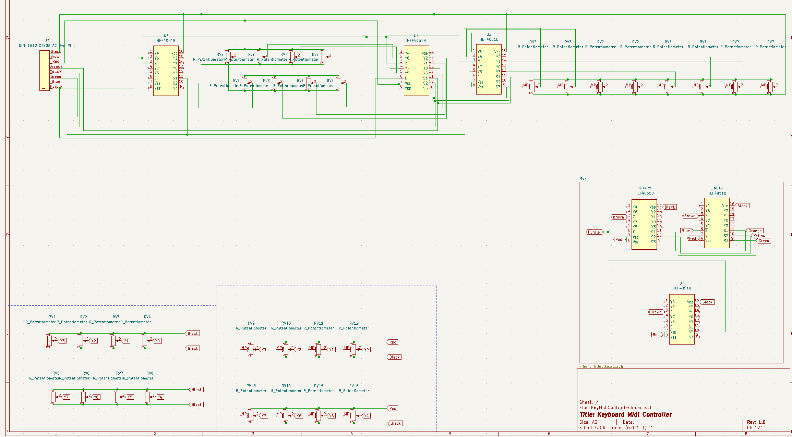

# Keyboard Midi Controller

This is my project for The Retrofuturistic Hardware VIP Fall '22

## Progress

- Set up KiCAD Project + Github Repo
- Created schematic for HEF4501BP Chip
- Created schematic for entire keyboard PCB
- Simple Arduino Sketch to read analog values from the keyboard

